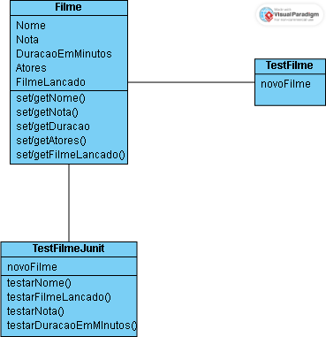

# Apresentação de Exercícios
---
Como Atividade de Apresentação do 2 bimestre, foi feito os exercícios, buscando entender melhor como funciona java e suas diversas ferramentas

1. Classe Filme

A classe Filme foi criada para representar um filme com atributos que a princípio eram nome, duração, nota, e status de lançamento, porém fiquei com vontade de adicionar atores também, o que me levou a pesquisar sobre listas e suas utilidade e funcionamentos, aprendi que coleções e arrays em Java são objetos, pertencentes a uma classe, com métodos próprios. Isso me levou a observar o comportamento de comparações usando o método .equals(), ja que Stings também são objetos em java, essencial para verificar conteúdos de objetos em vez de apenas endereços de memória.

2. Classe TestFilme

Escrevi uma classe com main para testar manualmente os métodos da classe Filme. Ela atribuia valores para um novo objeto filme criado e testava se esses valores eram atribuidos corretamente, com get e set.
Aqui usei condicionais if com .equals() para comparar textos e confirmar se as funções estavam corretas. Esse processo ajudou a visualizar a lógica e entender o funcionamento dos métodos de acesso e atualização dos atributos do objeto.

Após terminar este teste, me perguntei se existiria uma maneira mais fácil de fazer testes em java, e se teria algo como no haskell nos testes automatizados, foi aí que achei o JUnit.

3. Classe TestFilmeJunit

Nessa classe, utilizei @BeforeEach e @Test (este @ é como se eu disesse para que serve essas funções) e utilizei assertEquals() e assertTrue() para estruturar os testes e validar automaticamente os resultados.

---
### Diagrama de Classes

Foi feito também um diagrama de classes estilo UML, para ter uma visão macro do sistema. Evidenciando os atributos e mêtodos das classes

### Referências Bibliográficas

- https://online.visual-paradigm.com/
- https://docs.junit.org/current/user-guide/
- https://apidog.com/pt/blog/best-testing-java-tools-pt/
- https://www.delftstack.com/pt/howto/java/how-to-create-a-new-list-in-java/
